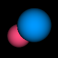

# pbrt-go

A toy ray tracer written to practice writing go.

Slowly working towards an implementation based on the excellent [3rd edition of PBRT](https://pbr-book.org), because I was too excited to wait for the 4th edition any longer. Supplemented by the also-great [Ray Tracing in One Weekend](https://raytracing.github.io/books/RayTracingInOneWeekend.html).

---

### Progress:

### Next Steps:

- Basic Material (flat color)
- Lights
